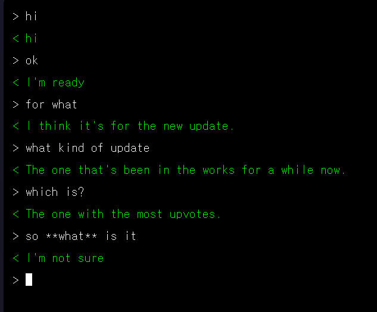

### Lab02

A simple chatbot containerized in Docker and ran on FastAPI.

- HTML/nginx & FastAPI
- microsoft/DialoGPT-medium

<p align="center">
  
</p>

## How To Deploy and Run

```bash
❯ docker-compose up --build -d
```

Note: It takes a while to build ... (backend is ~7GB)
Note 2: It takes some time (~3min) for backend to start run after it is deployed. Check the log

```bash
chat-backend   | 2025-08-17T07:33:55.714079147Z INFO:     Started server process [1]
chat-backend   | 2025-08-17T07:33:55.714213450Z INFO:     Waiting for application startup.
chat-backend   | 2025-08-17T07:33:55.714797866Z INFO:     Application startup complete.
chat-backend   | 2025-08-17T07:33:55.716661395Z INFO:     Uvicorn running on http://0.0.0.0:8000 (Press CTRL+C to quit)
```

needs to show up!


<br>

After the build is finished, visit Frontend and Backend via:
- Frontend(HTML): [http://localhost:3000](http://localhost:3000)
  - Frontend Health Check: [http://localhost:3000/health](http://localhost:/3000/health)
- Backend(FastAPI): [http://localhost:8000](http://localhost:8000)
  - Backend API documentation: [http://localhost:8000/docs](http://localhost:8000/docs)
  - Backend Health Check: [http://localhost:8000/health](http://localhost:/8000/health)

<br>

## How to Check Log Messages

```bash
# check all logs
docker-compose logs -f --timestamps

# to only check backend logs
docker logs chat-backend -f
# or
docker-compose logs backend -f

# to only check frontend logs
docker logs chat-frontend -f
# or
docker-compose logs frontend -f
```
